# Loan Servicing Management - Architecture

हा document backend कसा बनला आहे आणि प्रत्येक flow आतून कसा चालतो ते सांगतो. Diagrams **Mermaid** मध्ये आहेत: GitHub, IntelliJ (Mermaid plugin) आणि VS Code (Markdown Preview Mermaid) मध्ये आपोआप चित्र म्हणून दिसतात.

**Contents**
1. [Overview](#1-overview)
2. [System context](#2-system-context)
3. [Modules](#3-modules)
4. [Layers inside a module](#4-layers-inside-a-module)
5. [Database design](#5-database-design)
6. [Request lifecycle and security](#6-request-lifecycle-and-security)
7. [Business flows](#7-business-flows)
8. [Loan and payment states](#8-loan-and-payment-states)
9. [Error handling](#9-error-handling)
10. [Configuration and profiles](#10-configuration-and-profiles)
11. [Testing strategy](#11-testing-strategy)
12. [Design decisions](#12-design-decisions)
13. [How to add a new feature](#13-how-to-add-a-new-feature)

---

## 1. Overview

**काय करतो:** आधीच दिलेल्या loans चं servicing: borrower कडून हप्ते घेणे, ते interest/principal/escrow मध्ये विभागणे, lenders ना त्यांचा हिस्सा देणे, bounce (NSF) झालेले payments उलटवणे, late fees आणि defaults.

| Layer | Technology |
|---|---|
| Language | Java 21 |
| Framework | Spring Boot 3.5 (Web, Data JPA, Security, Validation, Scheduling) |
| ORM | Hibernate 6 (Spring Data JPA) |
| Database | PostgreSQL 16 (app), in-memory H2 (tests only) |
| Auth | JWT (jjwt), BCrypt passwords, `@PreAuthorize` role checks |
| API docs | springdoc OpenAPI / Swagger UI |
| Architecture checks | Spring Modulith (`ModularityTests`) |
| Boilerplate | Lombok (entities), Java records (DTOs, events) |

**Style:** Modular monolith. एक deployable app, पण 6 business modules ज्यांच्या boundaries test ने enforce होतात. प्रत्येक module पुढे microservice होऊ शकतो ([MICROSERVICES.md](MICROSERVICES.md)).

---

## 2. System context

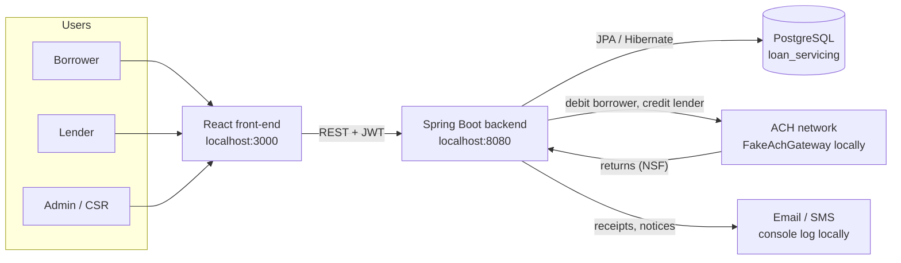

Local मध्ये ACH आणि email **fake** आहेत: कोणताही खरा पैसा किंवा message जात नाही.

---

## 3. Modules

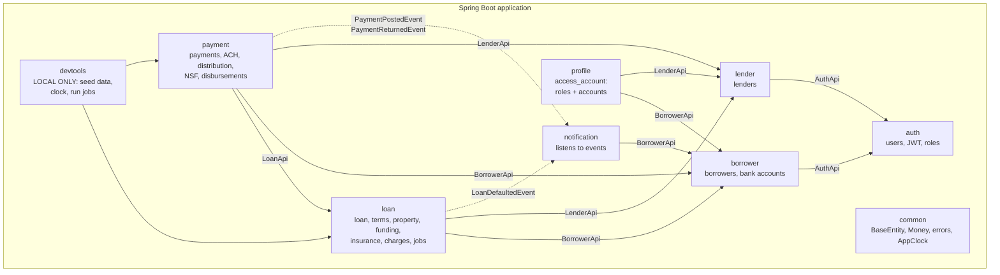

Solid arrow = direct call through a public `XxxApi` interface. Dashed arrow = event (fire-and-forget). Every module uses `common` (not drawn).

| Module | Public API (others may use) | Owns | REST prefix |
|---|---|---|---|
| auth | `AuthApi`, `CurrentUser`, `Role`, `AuthenticatedUser` | users | `/api/v1/auth` |
| lender | `LenderApi`, `LenderDto`, `CreateLenderRequest` | lenders | `/api/v1/lenders` |
| borrower | `BorrowerApi`, `BorrowerDto`, `BankAccountDto`... | borrowers, bank accounts | `/api/v1/borrowers` |
| loan | `LoanApi`, `LoanJobs`, `LoanDto`, `PaymentApplication`, `FundingShare`, `LoanDefaultedEvent`... | loans + children | `/api/v1/loans` |
| payment | `PaymentJobs`, `PaymentPostedEvent`, `PaymentReturnedEvent` | payments, disbursements, NSF cases | `/api/v1/payments`, `/disbursements`, `/nsf-cases` |
| notification | (none - listens only) | - | - |
| profile | (none) | - | `/api/v1/auth/access_account` |
| devtools | (none) | - | `/api/v1/dev` (local only) |

**Rules** (`ModularityTests` fails the build if broken):
- Module च्या base package मधले classes = public API. `internal` sub-package = private.
- Cycles नाहीत (loan → payment → loan असं चालणार नाही).

**Dependency direction का असं?** Loan balances loan module चे आहेत, म्हणून फक्त loan module ते बदलतो. Payment module पैसे हलवतो आणि loan module ला "हे apply कर" सांगतो (`LoanApi.applyPayment`). Loan module ला payments बद्दल काही माहीत नसतं.

---

## 4. Layers inside a module

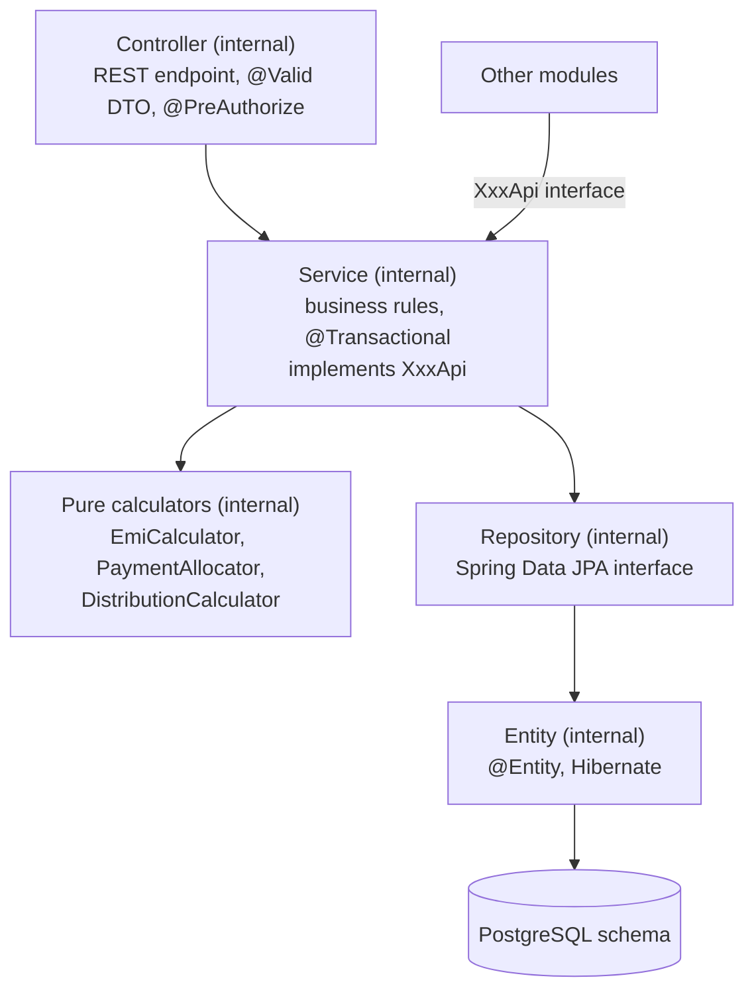

| Layer | Responsibility | Never does |
|---|---|---|
| Controller | HTTP ↔ DTO, validation, role check | business logic, entity return |
| Service | rules, transactions, calls other modules' APIs | know about HTTP |
| Calculator | pure maths (unit-testable, no Spring) | database access |
| Repository | queries | business rules |
| Entity | table mapping + small helpers (`daysPastDue`, `openCharges`) | call other beans |

**DTO vs Entity:** React ला कधीच `@Entity` जात नाही. DTOs (records) मध्ये फक्त UI ला हवं ते, आणि account number / TIN masked (`****1234`).

---

## 5. Database design

प्रत्येक module चे tables त्याच्या **स्वतःच्या PostgreSQL schema** मध्ये:

| Schema | Tables |
|---|---|
| `auth` | users |
| `lender` | lenders |
| `borrower` | borrowers, borrower_bank_accounts |
| `loan` | loans, loan_properties, loan_fundings, loan_insurances, loan_charges |
| `payment` | payments, payment_charge_lines, lender_disbursements, nsf_cases |

Schemas मध्ये **foreign keys नाहीत**. उदा. `loan.loans.borrower_id` हा फक्त number आहे, `borrower.borrowers` वर FK नाही. Schema च्या आत FKs आहेत (उदा. `loan_charges.loan_id → loans.id`).

Every table has `id` (identity), `created_at`, `updated_at`, `version` (optimistic locking) from `BaseEntity`.

```mermaid
erDiagram
    USERS {
        bigint id PK
        varchar email UK
        varchar password_hash
        varchar role
    }
    LENDERS {
        bigint id PK
        bigint user_id "ref auth.users"
        varchar name
        varchar routing_number
        varchar account_number
    }
    BORROWERS {
        bigint id PK
        bigint user_id "ref auth.users"
        varchar first_name
        varchar tin_type
        boolean send_late_notices
    }
    BORROWER_BANK_ACCOUNTS {
        bigint id PK
        bigint borrower_id FK
        varchar routing_number
        varchar account_number
        boolean active
    }
    LOANS {
        bigint id PK
        varchar loan_number UK
        bigint borrower_id "ref borrower.borrowers"
        varchar status
        numeric principal_balance
        numeric note_rate
        numeric monthly_pi_payment
        date next_due_date
        numeric reserve_balance
        numeric impound_balance
    }
    LOAN_FUNDINGS {
        bigint id PK
        bigint loan_id FK
        bigint lender_id "ref lender.lenders"
        numeric funded_amount
        numeric lender_rate
    }
    LOAN_PROPERTIES {
        bigint id PK
        bigint loan_id FK
        numeric appraised_value
    }
    LOAN_INSURANCES {
        bigint id PK
        bigint loan_id FK
        date expiration_date
    }
    LOAN_CHARGES {
        bigint id PK
        bigint loan_id FK
        varchar type
        numeric balance
        varchar status
    }
    PAYMENTS {
        bigint id PK
        bigint loan_id "ref loan.loans"
        numeric amount
        varchar status
        varchar idempotency_key UK
        varchar ach_reference UK
        numeric interest_paid
        numeric principal_paid
    }
    PAYMENT_CHARGE_LINES {
        bigint payment_id FK
        bigint charge_id "ref loan.loan_charges"
        numeric amount
    }
    LENDER_DISBURSEMENTS {
        bigint id PK
        bigint payment_id "ref payments"
        bigint lender_id "ref lender.lenders"
        numeric total_amount
        varchar status
    }
    NSF_CASES {
        bigint id PK
        bigint payment_id "ref payments"
        varchar return_code
        numeric fee_charged
    }

    BORROWERS ||--o{ BORROWER_BANK_ACCOUNTS : has
    LOANS ||--o{ LOAN_FUNDINGS : "funded by"
    LOANS ||--o{ LOAN_PROPERTIES : "secured by"
    LOANS ||--o{ LOAN_INSURANCES : "insured by"
    LOANS ||--o{ LOAN_CHARGES : owes
    PAYMENTS ||--o{ PAYMENT_CHARGE_LINES : "paid charges"
```

("ref ..." = cross-module reference by ID only, no FK.)

**Money columns:** `numeric(15,2)`, rates `numeric(7,4)`. Java मध्ये नेहमी `BigDecimal`, rounding `Money.of()` ने (2 decimals, HALF_UP).

---

## 6. Request lifecycle and security

### Login आणि authenticated request

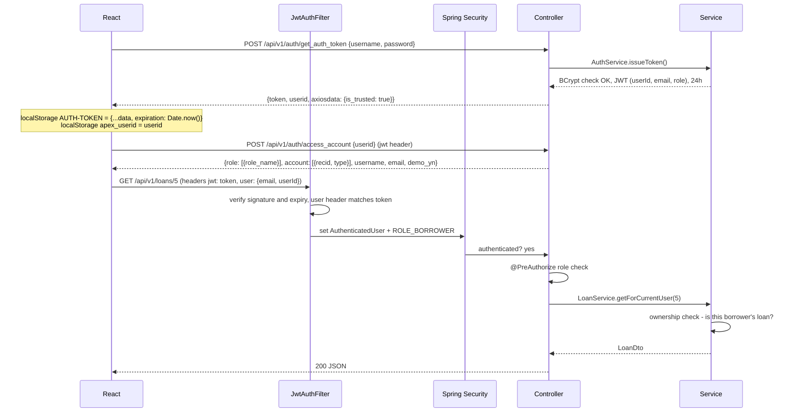

**दोन पातळ्यांवर check:**

| Check | कुठे | उदाहरण |
|---|---|---|
| Role | `@PreAuthorize` on controller | फक्त ADMIN loan onboard करू शकतो |
| Ownership | service (`checkCanView`) | BORROWER फक्त स्वतःचे loans, LENDER फक्त fund केलेले |

Role check पुरेसा नाही: सगळ्या borrowers कडे BORROWER role आहे, पण प्रत्येक फक्त स्वतःचं loan पाहू शकतो.

| Role | काय करू शकतो |
|---|---|
| ADMIN | onboard lenders/borrowers/loans, charges add/waive, सगळं पाहणे |
| CSR | सगळं पाहणे, charges add, NSF cases |
| LENDER | funded loans, स्वतःचे disbursements |
| BORROWER | स्वतःचे loans, bank accounts, payments |

**JWT - LoanLinq सारखंच:**

| Step | LoanLinq front-end | हा backend |
|---|---|---|
| Login | `POST urls.admin.getAuthToken` `{username, password, fingerprint, userId}` | `POST /api/v1/auth/get_auth_token` (fingerprint/userId accepted, not used yet) |
| Response | `res.data.token`, `res.data.userid`, `res.data.axiosdata.is_trusted` | same fields; `is_trusted: true` (local मध्ये OTP step नाही) |
| Store | `AUTH-TOKEN` = `{...res.data, expiration: Date.now()}`, `apex_userid` | - |
| Roles/accounts | `access_account` `{userid}` → `role[].role_name`, `account[]` | `POST /api/v1/auth/access_account` |
| Every request | axios interceptor: `jwt: token`, `user: {"email","userId"}` | `JwtAuthFilter` reads `jwt`; `user` header must match the token |
| Expiry | client side: 24h after login (`86400000`) | token `exp` = 24h (`app.jwt.expiration=86400000`) |

Stateless (server वर session नाही). Postman/curl साठी `Authorization: Bearer <token>` पण चालतो.

---

## 7. Business flows

### 7.1 Loan onboarding (admin)

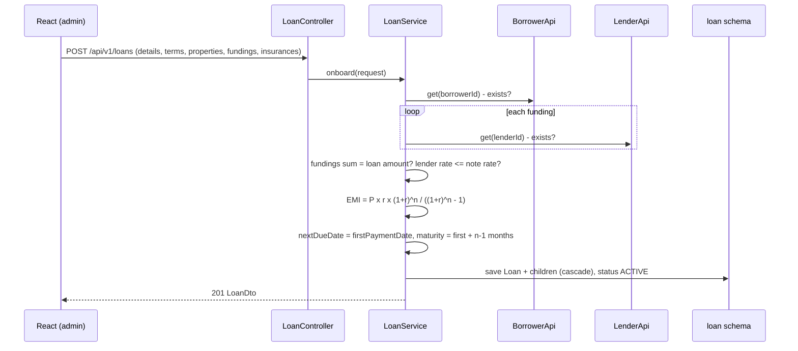

### 7.2 Borrower payment (the main flow)

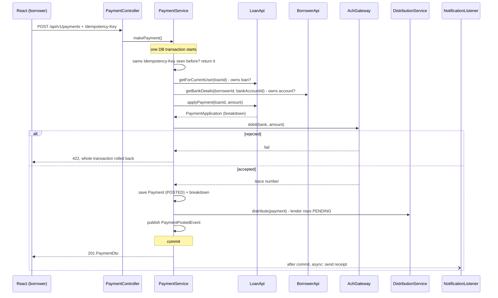

**Payment waterfall** (`PaymentAllocator`):

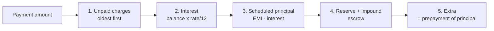

- Amount < steps 1-4 → `422 Minimum payment is ...`
- Amount > payoff → `422 Payment is more than the payoff amount`
- नंतर: principal कमी, escrow balances वाढतात, `nextDueDate` +1 month, principal 0 झाला तर `PAID_OFF`, DEFAULT loan current झालं तर परत `ACTIVE`.

**Example** (300,000 @ 12%, 360 months, EMI 3,085.84, reserve 150, impound 250):

| Part | Amount |
|---|---|
| Interest (300,000 × 1%) | 3,000.00 |
| Principal (3,085.84 − 3,000) | 85.84 |
| Reserve | 150.00 |
| Impound | 250.00 |
| **Minimum payment** | **3,485.84** |

### 7.3 Lender distribution

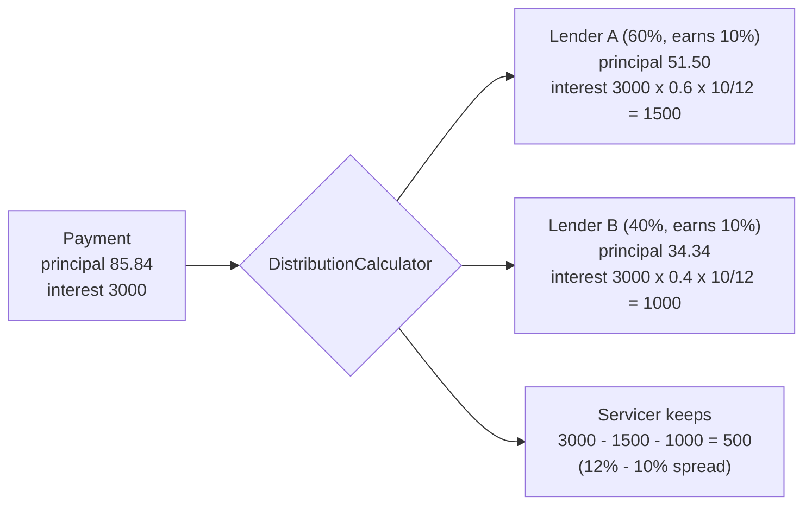

- Principal share = funded ÷ loan amount. Rounding चा उरलेला paisa शेवटच्या lender ला, म्हणजे total नेहमी बरोबर.
- Escrow आणि fees lenders ना जात नाहीत.
- Rows `PENDING` म्हणून save होतात. Nightly **disbursement job** प्रत्येक lender चं net (positive rows − clawbacks) ACH credit करतो आणि rows `PAID` करतो.

### 7.4 NSF (bounced payment)

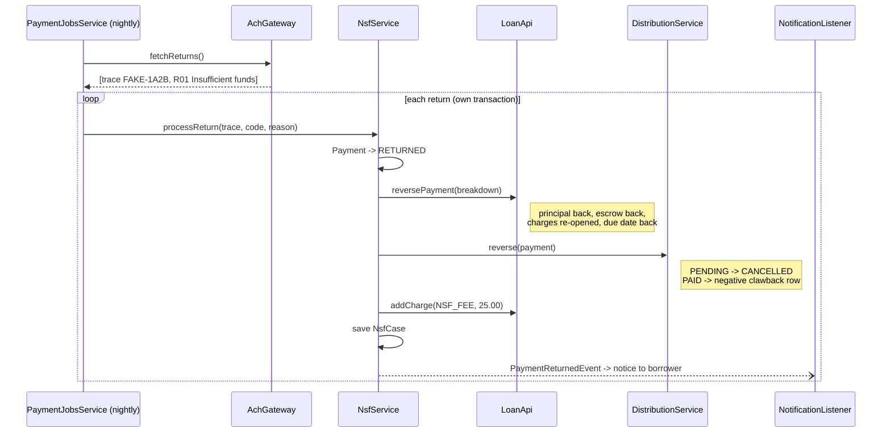

Payment row कधीच delete होत नाही, फक्त status बदलतं. History पूर्ण राहते.

Local testing: bank account number `...0000` ने संपला तर `FakeAchGateway` ते payment return करतो.

### 7.5 Nightly jobs

| Time | Job | Module | काय करतो |
|---|---|---|---|
| 01:00 | Late charges | loan | `nextDueDate + graceDays < today` आणि या installment साठी fee लागली नसेल → LATE_FEE = max(P&I × %, minimum) |
| 01:15 | Default check | loan | 31+ days past due → `DEFAULT`, `LoanDefaultedEvent` |
| 02:00 | ACH returns | payment | bounced payments → NSF flow |
| 03:00 | Disbursements | payment | lenders ना net amount credit |

Cron `application.properties` → `app.jobs.*`. Local मध्ये कधीही चालवा: `POST /api/v1/dev/jobs/run-all`.

**AppClock:** सगळे services `LocalDate.now(clock)` वापरतात. Local मध्ये `POST /api/v1/dev/clock/advance?days=40` ने app ची तारीख पुढे जाते, म्हणजे late/default flows लगेच test होतात.

### 7.6 Amount due and payoff

`GET /api/v1/loans/{id}/amount-due` → `totalDue` (minimum payment) आणि `payoffAmount` = principal balance + current interest + unpaid charges.

---

## 8. Loan and payment states

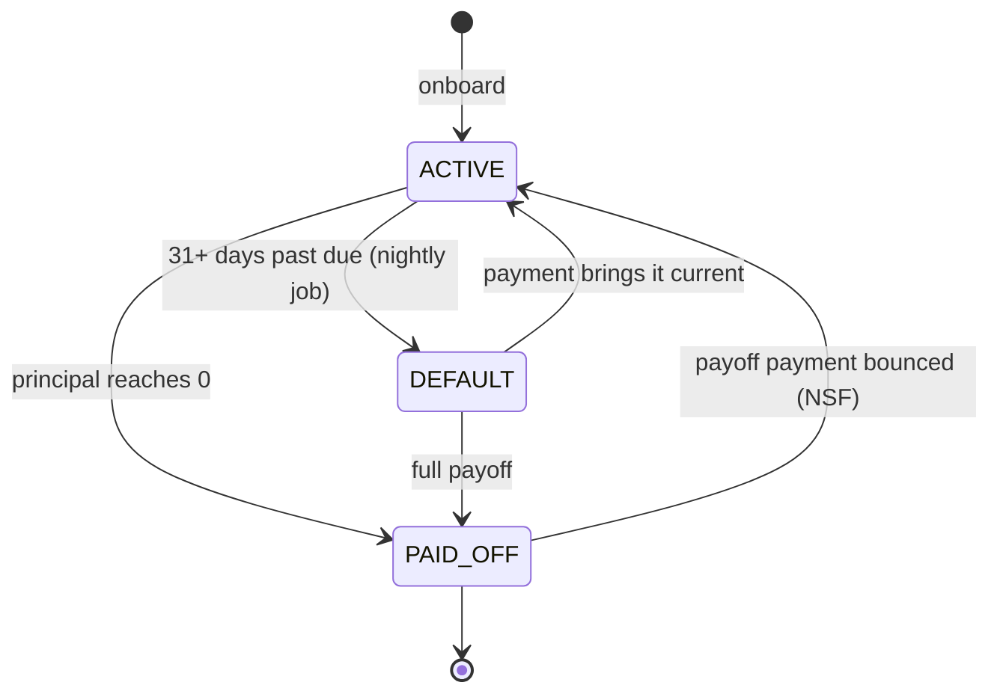

| Entity | States |
|---|---|
| Payment | `POSTED` → `RETURNED` (NSF) |
| Loan charge | `OPEN` → `PAID` / `WAIVED` (NSF reversal: `PAID` → `OPEN`) |
| Lender disbursement | `PENDING` → `PAID` / `CANCELLED` |

---

## 9. Error handling

Services फक्त exception throw करतात; `GlobalExceptionHandler` status ठरवतो:

| Exception | HTTP | कधी |
|---|---|---|
| `MethodArgumentNotValidException` | 400 | DTO validation fail (`fieldErrors` सहित) |
| (no/invalid token) | 401 | login नाही |
| `AccessDeniedException` | 403 | role किंवा ownership fail |
| `NotFoundException` | 404 | record नाही |
| `ObjectOptimisticLockingFailureException` | 409 | दोन requests ने एकच record एकाच वेळी बदलला |
| `BusinessException` | 422 | business rule fail (minimum payment, fundings total...) |
| anything else | 500 | log मध्ये stack trace |

Response नेहमी: `{timestamp, status, error, message, fieldErrors}`.

---

## 10. Configuration and profiles

सगळी configuration **एकाच file** मध्ये: `src/main/resources/application.properties`.

| Profile | कधी | काय बदलतं |
|---|---|---|
| `local` (`spring.profiles.active=local`) | तुमच्या laptop वर | sample data, `/api/v1/dev/**` tools |
| `test` | `mvn test` (`@ActiveProfiles`) | in-memory H2 (settings test class मध्ये), no sample data, no dev tools |

Main settings:

| Key | Default | Meaning |
|---|---|---|
| `spring.datasource.*` | `localhost:5432/loan_servicing`, postgres / root | DB connection |
| `app.jwt.secret` | local value | ≥ 32 chars; production मध्ये env variable |
| `app.jwt.expiration` | 86400000 (ms) | token life = 24 hours (LoanLinq सारखं) |
| `app.cors.allowed-origins` | localhost:3000, 5173 | React dev servers |
| `app.ach.mode` | `fake` | `FakeAchGateway` |
| `app.fees.nsf-fee` | 25.00 | NSF fee |
| `app.jobs.*-cron` | 01:00-03:00 | nightly jobs |

---

## 11. Testing strategy

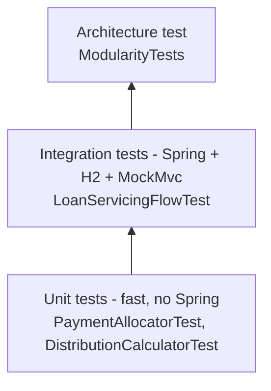

| Test | Covers |
|---|---|
| `PaymentAllocatorTest` | EMI, installment, waterfall order, min/max payment, last installment |
| `DistributionCalculatorTest` | lender split, servicer spread, rounding |
| `LoanServicingFlowTest` | pay → loan updated → lender rows; idempotency; 401/403; NSF reversal + fee; late fee once; default |
| `ModularityTests` | module boundaries, no cycles; writes diagrams to `target/spring-modulith-docs` |

---

## 12. Design decisions

| Decision | Why |
|---|---|
| Modular monolith first | एका app मध्ये शिकणं, debug करणं सोपं; boundaries आधीच बरोबर असल्याने नंतर split सोपं |
| Modules talk via `XxxApi` interfaces | उद्या same interface चं HTTP (Feign) implementation आलं तरी caller बदलत नाही |
| IDs across modules, no JPA relations | प्रत्येक module चा data वेगळ्या DB मध्ये जाऊ शकतो |
| One PostgreSQL schema per module | database-per-service ची पहिली पायरी; `pg_dump --schema` ने हलवता येतो |
| Events for notifications | payment ला email बद्दल माहीत नसावं; उद्या Kafka |
| `@TransactionalEventListener` + `@Async` | rolled-back payment साठी receipt नाही; slow email API ला slow करत नाही |
| One transaction for payment | ACH reject झालं तर loan update पण rollback |
| Idempotency-Key | React/axios retry मुळे double charge नाही |
| Payments never deleted | audit: bounce = status change + reversing entries |
| Pure calculator classes | पैशांचं गणित Spring शिवाय test करता येतं |
| `BigDecimal` everywhere | `double` rounding errors नाहीत |
| `AppClock` | तारखांवर अवलंबून logic test करता येतं |
| `@Version` optimistic locking | एकाच loan वर दोन payments एकाच वेळी आले तर एक fail होतो, data corrupt होत नाही |
| Fake gateways behind interfaces | local मध्ये खरा पैसा नाही; production मध्ये फक्त नवीन implementation |

---

## 13. How to add a new feature

उदाहरण: **Draw requests** (construction loans साठी टप्प्याटप्प्याने पैसे) - नवीन module.

1. Package तयार करा: `com.loanservicing.draw`
2. Public API: `DrawApi` interface, `DrawRequestDto`, `CreateDrawRequest` (records) - base package मध्ये
3. `draw/internal/`: `DrawRequest` entity (`@Table(schema = "draw")`, `Long loanId` - Loan entity नाही), `DrawRequestRepository`, `DrawService implements DrawApi`, `DrawController` (`/api/v1/draws`)
4. Loan data लागला तर `LoanApi` inject करा. Loan मध्ये काही बदलायचं असेल तर `LoanApi` मध्ये नवीन method (loan module मध्ये implement)
5. इतरांना कळवायचं असेल तर event record (`DrawApprovedEvent`) publish करा
6. Tests: calculator साठी unit test, flow साठी `LoanServicingFlowTest` सारखा test
7. `mvn test` - `ModularityTests` pass झाला म्हणजे boundaries बरोबर आहेत
